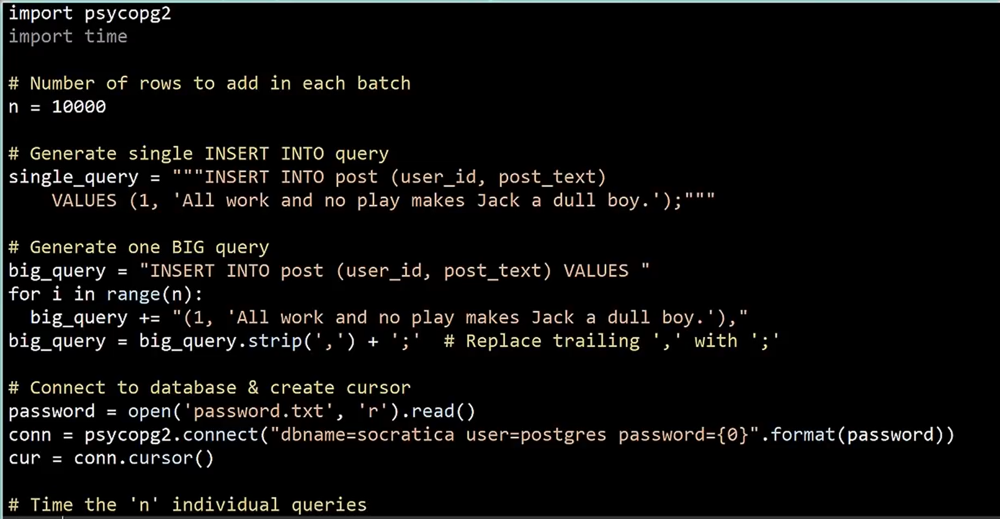
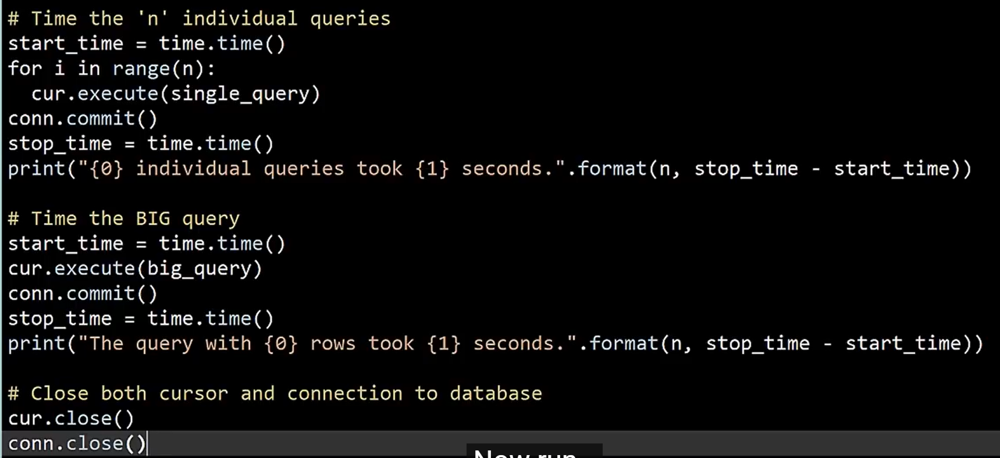

---
# <center> *__🌐 SQL Concepts from [Socratica](https://www.youtube.com/playlist?list=PLi01XoE8jYojRqM4qGBF1U90Ee1Ecb5tt)__*
---

*Prompt for summary :*
```text
Please summarize the topics mentioned in the video with clear explanation & example(s) in markdown format. Keep the explanation clear, as it is mentioned in the youtubelink & use tabular columns and flow diagrams for explanation in ASCII format i.e. inside a ASCII window in markdown. Highlight the key words in definitions via `` for better readability.
```

*enhanced prompt -*
```markdown
Act as a technical expert and knowledge base architect.** Based on the provided transcript, create a structured SQL reference guide in Markdown following these exact requirements:

1.  **Overview:** Provide a brief summary of the video's core focus (e.g., SQL basics, CRUD operations, or performance optimization).
2.  **Conceptual Definitions:** Define high-level concepts mentioned (e.g., `Relational Database`, `Schema`, `Primary Keys`). **Crucial:** Use backticks ` ` to highlight every technical term or SQL keyword.
3.  **Command Reference:** For every SQL command discussed (e.g., `CREATE`, `SELECT`, `UPDATE`), include:
    - A clear explanation of its purpose.
    - A code block containing the specific SQL example used in the transcript (e.g., `CREATE DATABASE social_network;`).
4.  **Visualizations:** Provide ASCII block diagrams to illustrate table structures, schemas, or data relationships (such as the connection between `users` and `purchases` tables).
5.  **Quick Summary Table:** A 3-column Markdown table listing the `Command`, its `Category` (e.g., DDL, CRUD, or Advanced), and a 1-sentence `Description`.
6.  **Formatting:** Use **bold text** for key takeaways and ensure all SQL keywords, command names, and technical terms are enclosed in backticks ` ` for better readability.
7. If there are SQL commands, please put them inside ```sql ``` window.

**Grounding Instruction:** Strictly use the examples, table names (like `users`, `movies`), and database names (like `social_network`) provided in the source material.
```
---

## <u>*__Contents__*</u>

1. [SQL quick overview](#1-sql-a-quick-overview)
2. [Relational Databases : How to choose?](#2-relational-databases--how-to-choose)
3. [PostgreSQL - Installation & Overview](#3-postgresql---installation--overview)
4. [SQL `SELECT` Tutorial](#4-sql-select-tutorial) 
    - Topics : 
    ```
    ORDER BY, LIMIT, COUNT
    ```
5. [SQL `SELECT` Tutorial : Part 2](#5-sql-select-tutorial--part-2)
    - Topics :
    ```
    > Funtions : COUNT, MIN, MAX, AVG, SUM
    > Keywords : DISTINCT, BETWEEN, LIKE
    ```
6. [SQL `INSERT INTO` Statement](#6-sql-insert-into-statement)
    - Topics :
    ```

    ```

---

## <u> *__1. SQL a quick overview__* </u> 

- `SQL` : `S`tructured `Q`uery `L`anguage is a language used for handling databases `CRUD`
- `CRUD` : `C`reate `R`ead `U`pdate `D`elete operation done on a data base.
- Ted Cod laid the foundations for the relational databases (in 1970 11 pages paper).
- A `relataional database` consists fo a collection of tables. Each table has a defined set of colums & rows containing data.
- Each row is called a record 
- The data between the tables can be related to each other, hence they are called as `relational database`
- The `SELECT` statement gives you the ability to choose data from multiple tables in a process called `joins`
- A related solution would be to select a virtual table called a `View`, this table-like obj collects matching data from multiple tables & makes it easily accessible as if we were working on a single table.
- <br>

### <u> __Summary from Note book LLM__ </u>

This summary provides an overview of **SQL (Structured Query Language)** based on the provided video transcript. SQL is the standard language used for managing data within a **Relational Database Management System (DBMS)**.

### **Core Concepts of Relational Databases**
The foundation of relational databases was established by **E.F. Codd**, who proposed that data banks should protect users from needing to know how data is organized internally.

*   **Relational Database:** A collection of **tables** where data in one table can be related to data in another.
*   **Table Structure:** Each table consists of **columns** (defined sets of data types) and **rows** (individual records).
*   **Schema:** The complete collection of tables within a database.
*   **Primary Keys:** Unique identifiers (usually numbers) assigned to each row to distinguish records.


Here is a summary of the core concepts of **SQL (Structured Query Language)**, which is used for managing data within a **Database Management System (DBMS)**.

### **1. Core Database Concepts**
A `relational database` is a collection of tables where data in one table can be related to data in another. These databases are managed by a `Database Management System` (DBMS).

| Term | Definition |
| :--- | :--- |
| `Schema` | The complete collection of tables within a database. |
| `Table` | A structure consisting of a defined set of columns and rows. |
| `Record` | An individual row containing data within a table. |
| `Primary Key` | Numbers (often ending in "ID") that `uniquely identify` each row of data. |

```ascii
+---------------------------------------------------------+
|                    DATABASE SCHEMA                      |
|  +---------------------------------------------------+  |
|  |                TABLE: "users"                     |  |
|  +------------+------------+-----------+-------------+  |
|  | user_id    | first_name | last_name | email       |  |
|  | (Primary)  |            |           |             |  |
|  +------------+------------+-----------+-------------+  |
|  | 1          | Alice      | Smith     | a@mail.com  |  <-- RECORD
|  | 2          | Bob        | Jones     | b@mail.com  |  
|  +------------+------------+-----------+-------------+  |
+---------------------------------------------------------+
```

---

### **2. Managing Database Structure (DDL)**
These commands allow you to build and modify the database `schema`. SQL commands generally end with a `semicolon`.

*   **`CREATE DATABASE`**: Initializes a new database.
    *   *Example:* 
    ```sql
    CREATE DATABASE social_network;
    ```
*   **`CREATE TABLE`**: Defines the table name, its columns, and their `datatypes`.
    *   *Example:* <br>
    ```sql
    CREATE TABLE users (
        user_id INT, 
        first_name VARCHAR(100),
        last_name VARCHAR(100),
        email VARCHAR(255));
    ```
*   **`ALTER TABLE`**: Changes an existing table, such as adding a new column.
    *   *Example:* 
    ```sql
    ALTER TABLE users ADD encrypted_password VARCHAR (1000);
    -- to drop only the say one column you can do
    ALTER TABLE users DROP COLUMN email;

    ```
*   **`DROP`**: "Cancels the existence" of a column, a table, or the entire database.
    *   *Example:* 
    ```sql
    DROP TABLE users;
    --- to wipe the slate completely clear, you can completely delte the whole database
    DROP DATABASE social_network
    ```

---

### **3. Interacting with Data (CRUD Operations)**
`CRUD` stands for Create, Read, Update, and Delete—the four essential ways to handle data.

#### **Create: `INSERT INTO`**
Adds new records by specifying the table, the columns, and the `VALUES` to be stored.
*   *Example:* 
```sql
INSERT INTO movies (title) VALUES ('Jaws');

-- another eg
INSERT INTO movies (movie_id, title, description, price)
VALUES (1, 'Galactta', 'Movie or documentary', 4.99);

```

#### **Read: `SELECT`**
Retrieves data or look at the data from the database. Use an `asterisk (*)` to return all columns or specify individual ones.
*   *Example:* 
```sql
SELECT title, price FROM movies;
-- another eg : 
SELECT * FROM movie;
```
*   **Sorting:** Use `ORDER BY` to sort records; use the `DESC` keyword for descending order.

#### **Update: `UPDATE`**
Changes existing data. It uses `SET` to define the new value and a `WHERE` statement to target specific records.
*   *Example:* 
```sql
UPDATE movies SET price = 10 WHERE title = 'Jaws';
```

#### **Delete: `DELETE FROM`**
Removes records. A `WHERE` statement is critical here to ensure only the intended records are deleted.
*   *Example:* 
```sql
DELETE FROM movies WHERE title = 'Star Wars';
```

---

### **4. Performance and Advanced Logic**
As databases grow to include billions of records, these tools ensure efficiency and safety.

*   **`Joins`**: A process that allows you to choose and combine data from `multiple tables` at once.
*   **`View`**: A "virtual table" that collects matching data from multiple tables and makes it accessible as a single object.
*   **`Index`**: A structure created to ensure queries remain `fast and efficient`, preventing the database from having to search every record.
*   **`Transactions`**: Group several changes together to ensure data is `safe` if a problem occurs mid-process.


```ascii
+-------------------+       +-------------------+
|      USERS        |       |     PURCHASES     |
+-------------------+       +-------------------+
| user_id (PK)   ---|------>| purchase_id       |
| first_name        |       | user_id (FK)      |
| last_name         |       | movie_id          |
+-------------------+       +-------------------+
          ^                           |
          |          JOINS            V
          +---------------------------+
             [ VIEW / JOINED RESULT ]
             | Name  | Movie Purchased |
             | Alice | Jaws            |

```
*(Note: PK = Primary Key; FK = Foreign Key, used to relate data between tables)*

---
---

## <u> *__2. Relational Databases : How to choose?__* </u> 

- Demand for open source grew as many people became developers.... `MY-SQL` is quire famous & is the `M` in the `LAMP` stack.
- `LAMP` : `L`inux, `A`pache, `M`ySQL, `P`HP
- few opensource SQL - PostgresSQL 🐘, MariaDB 🦭, MySQL 🐬, SQLite, etc

### <u> __Summary from Note book LLM__ </u>

This guide combines the foundational `SQL` commands from our previous discussion with the new strategic insights on selecting a `Relational Database` platform.

### **1. Overview**
- The primary focus of the source material is the **evaluation and selection of a `Relational Database` system**. 
- It emphasizes that while `SQL` is the universal language used to interact with these systems, the choice of platform depends on factors like **cost (Free vs. Commercial)**, **scale (Small vs. Petabytes)**, and **environment (Local vs. Cloud)**.

### **2. Conceptual Definitions**
*   **`Relational Database`**: A system where data is organized into tables and managed using `SQL`.
*   **`Open Source`**: Free-to-use software supported by a community, such as `MySQL`, `Postgres`, `MariaDB`, and `SQLite`.
*   **`Commercial Database`**: Established, paid systems (e.g., Oracle, IBM, Microsoft) often used for their dedicated on-demand support.
*   **`Cloud Computing`**: A model where "Tech Giants" provide hardware and massive data centers, allowing users to focus on software and scale rapidly.
*   **`Horizontal Scaling`**: The ability to handle surges in demand by rapidly adding more servers to a system.
*   **`Latency`**: The delay in data processing; cloud providers offer extremely low `latency` due to global data centers.
*   **`Migration`**: The process of moving a database from a local environment to the cloud, which is straightforward for systems like `Postgres` and `MySQL`.

### **3. Command Reference**
While the latest source focuses on platform selection, the following `SQL` commands are the essential tools used to "talk to such systems".

#### **`CREATE TABLE`**
Used to define the structure of your data within the selected database.
```sql
CREATE TABLE users (
    user_id INT PRIMARY KEY,
    first_name TEXT,
    last_name TEXT
);
```

#### **`SELECT`**
The command used to retrieve data from the "ocean of data" stored in your tables.
```sql
SELECT first_name, last_name FROM users ORDER BY last_name ASC;
```

#### **`INSERT INTO`**
Used to add new records to the database.
```sql
INSERT INTO users (user_id, first_name, last_name) 
VALUES (1, 'Jane', 'Doe');
```

#### **`UPDATE`**
Used to modify existing data. **Always use a `WHERE` clause to avoid updating all records.**
```sql
UPDATE users SET first_name = 'Janet' WHERE user_id = 1;
```

### **4. Visualizations**

**The Decision Matrix: Local vs. Cloud**
```ascii
+-----------------------+                    +-------------------------+
|     LOCAL SERVER      |                    |     CLOUD SOLUTIONS     |
+-----------------------+                    +-------------------------+
| * Total Control       |       VS.          | * High Scalability      |
| * Fixed Costs         |                    | * Low Latency           |
| * Small Data/Users    |                    | * Petabytes of Data     |
| * Time-Consuming Maint|                    | * Usage-Based Billing   |
+-----------+-----------+                    +------------+------------+
            |                                             |
            +--------------------[CHOICE]-----------------+
```

**Scalability and Data Relationships**
```ascii
      [ APP SPIKES IN POPULARITY ]
                  |
        +---------V---------+
        | HORIZONTAL SCALE  | <--- "Add more servers rapidly"
        +---------+---------+
                  |
   +--------------+--------------+
   |              |              |
[Server 1]     [Server 2]     [Server 3] ... [Server N]
```

### **5. Quick Summary Table**

| Command / Term | Category | Description |
| :--- | :--- | :--- |
| `Postgres` | Platform | A rapidly growing, `open source` database with strong cloud support. |
| `MySQL` | Platform | The "M" in the `LAMP stack`; reliable and widely available in the cloud. |
| `SELECT` | CRUD | Retrieves data from the database for `Analytics` or user display. |
| `Horizontal Scale` | Advanced | The ability to add servers to handle a "rain of data". |
| `Transactions` | Advanced | Ensures data safety during multiple grouped changes (from conversation history). |
| `Joins` | Advanced | Combines data from multiple tables to build `AI` or `ML` models. |

### **Key Takeaways**
*   **Most database skills (like `SQL`, `Database Design`, and `Optimization`) transcend the specific platform you choose**.
*   **Cloud solutions may cost more in money but significantly less in TIME**, allowing you to focus on building features like `Machine Learning`.
*   **If you are unsure where to start, `Postgres` or `MySQL` are excellent compromises**, as they are easy to migrate from a local server to the cloud later.

---
## <u> *__3. PostgreSQL - Installation & Overview__* </u> 

- The reason the logo for postgresql is elephant is becuause, elephants 🐘 have amazing memory!
- Make sure to uncheck the `pgadmin` check box in the installer, we will install it separately.
- `pgAdmin` is a Postgres GUI tool.
- Uncheck `stack builer` after installation, prior to clicking `Finish`

### <u> __Summary from Note book LLM__ </u>

### **1. Overview**
This source provides an introduction to **`PostgreSQL` (often shortened to `Postgres`)**, an advanced, **open-source `relational database`**. The focus is on its historical evolution from the `Ingres` and `POSTgres` projects at Berkeley, the installation process for the database and the `pgAdmin` `GUI`, and the initial steps to create a database named `socratica`,,.

### **2. Conceptual Definitions**
*   **`PostgreSQL`**: A "free," open-source `relational database` that supports `SQL`,.
*   **`Ingres`**: The 1970s research project at Berkeley that served as the predecessor to `Postgres`.
*   **`SQL`**: The standardized query language adopted by the project in the 1990s to replace "POSTQUEL".
*   **`pgAdmin`**: A `GUI` (Graphical User Interface) tool used to manage `Postgres` databases visually,.
*   **`Superuser`**: A high-privilege account (defaulted to the name `postgres`) that has full control over the database system,.
*   **`Port`**: The communication endpoint for the server; `Postgres` defaults to `5432`.
*   **`Schema`**: A logical container within a database used to organize features like `tables`; the default is the `public` `schema`.
*   **`Tables`**: The essential structures within a `schema` where data is actually stored.

### **3. Command Reference**
While the video demonstrates using the `pgAdmin` `GUI`, it emphasizes that the **`SQL` tab** reveals the underlying commands being executed. 

#### **`CREATE DATABASE`**
This command initializes a new database container. The source specifically demonstrates creating one for the `socratica` project.
```sql
CREATE DATABASE socratica;
```

---

### **4. Visualizations**

**The `pgAdmin` Sidebar Hierarchy**
```ascii
+---------------------------------------+
| SERVERS (Server Group)                |
|  |                                    |
|  +-- PostgreSQL 11 (Elephant Icon)|
|       |                               |
|       +-- Login and Group Roles       |
|       +-- Tablespaces                 |
|       +-- DATABASES                   |
|            |                          |
|            +-- postgres (Default)     |
|            +-- socratica (User Created)
|                 |                     |
|                 +-- SCHEMAS           |
|                      |                |
|                      +-- public       |
|                           |           |
|                           +-- Tables  |
+---------------------------------------+
```

---

### **5. Quick Summary Table**

| Command / Term | Category | Description |
| :--- | :--- | :--- |
| `CREATE DATABASE` | DDL | Used to create a new database like `socratica`. |
| `postgres` | Role | The default `superuser` account for the system. |
| `5432` | Configuration | The default `port` used by the `Postgres` server. |
| `public` | Schema | The default `schema` created within every new database. |
| `pgAdmin` | Tools | The `GUI` tool used to manage the database without the command line. |

---

### **Key Takeaways**
*   **`PostgreSQL` is named "Post" because it was the follow-up project to `Ingres`**.
*   **The elephant mascot "Slonik" is used because "elephants never forget," symbolizing database reliability**.
*   **Always check the `SQL` tab in `pgAdmin` to learn the actual code snippets behind your visual actions**,.
*   **Engineers often prefer `command line tools` over a `GUI` to earn "double respect points"**.

---
---

## <u> *__4. SQL `SELECT` Tutorial__* </u> 

- Using `joins` you can access data from different tables.
- The `Primary key 🗝️` is the value that is used to uniquely identify each row in the table
- The earth quake file can be found [Here](https://github.com/socratica/sql/blob/master/data/earthquake.csv).
- Run : 
    ```sql
    SELECT * From earthquake;
    ```
- this will run the query & fetch all the details. 
- This above query had two parts :
    - `SELECT` : lists the comluns you want data for
    - `FROM` : statement specifies which tables to select the data from
    - `*` : returns all columns, even the shy ones.

-  You can click on the `messages` tab to see how long the query took & how many rows were affected.
- Another way to find the rows in the table is to use the `COUNT` function
    ```sql
    SELECT COUNT (*) FROM earthquake;
    ```
- Now instead of fetching more columns, we can get more specific.
    ```sql
        SELECT magnitude, place, occured_on FROM earthquake;
    ```
- There is a 3rd part of our SQL query. It's the `WHERE` clause. We select `columns` using `SELECT` & use `WHERE` to select `rows`
- Now we run the query to select all the earthquakes that occured on or after Jan 1, 2000
    ```sql
        SELECT *
        FROM earthquake
        WHERE occured_on >= '2000-01-01';
    ```
- Now, we ask the question : **What was the largest earthquake in `2010`?**
    ```sql
    SELECT *
    FROM earthquake
    WHERE occured_on >= '2010-01-01' AND occured_on <= '2010-12-31'
    ORDER BY magnitude DESC
    LIMIT 1;       
    ```


### <u> __Summary from Note book LLM__ </u>

This structured reference guide is based on the "Socratica" tutorial regarding the `SELECT` statement, focusing on the `earthquake` dataset.

### **Overview**
The core focus of this source is the **retrieval of data from a single table** using the `SELECT` statement. It covers basic queries, specific column selection, row filtering with the `WHERE` clause, sorting results via `ORDER BY`, and optimizing performance using the `COUNT` function and `LIMIT` keyword.

### **Conceptual Definitions**
*   **`Query`**: A precise request written in `SQL` to scan and retrieve data from a database.
*   **`Table`**: A structured set of data; the source uses a table named `earthquake` containing tectonic activity data from 1969 to 2018.
*   **`Primary Key`**: A value that uniquely identifies each row in a table. In the provided example, `earthquake_id` serves as the `primary key`.
*   **`Asterisk (*)`**: A wildcard character used in a `SELECT` statement to instruct the database to return all columns from a table.
*   **`CSV`**: Comma-separated values file; the format used to provide the `earthquake` dataset for download.
*   **`Functions`**: Built-in operations like `COUNT` that can be used within queries to perform calculations on data.
*   **`JOINS`**: A technique mentioned for retrieving data from multiple tables simultaneously (though the source focuses on single-table queries).


### **Visualizations**

**The `earthquake` Table Structure**
```ascii
+-----------------------------------------------------------------------+
|                          TABLE: earthquake                            |
+----------------+------------------------------------------------------+
| COLUMN NAME    | DESCRIPTION                                          |
+----------------+------------------------------------------------------+
| earthquake_id  | [Primary Key] Unique ID for each quake               |
| occurred_on    | Date/Time of the event                               |
| latitude       | Geographic coordinate                                |
| longitude      | Geographic coordinate                                |
| depth          | Measured in kilometers                               |
| magnitude      | Strength of the quake (5.5 or greater)               |
| calculation_...| Code for formula used to compute magnitude           |
| network_id     | Alternative key from data contributor                |
| place          | Human-readable location                              |
| cause          | Origin of the quake                                  |
+----------------+------------------------------------------------------+
```

---

### **Quick Summary Table**

| Command | Category | Description |
| :--- | :--- | :--- |
| `SELECT` | CRUD (Read) | Lists the columns you want to retrieve. |
| `FROM` | CRUD (Read) | Specifies the source table for the data. |
| `COUNT` | Function | Returns the number of rows; faster than selecting all data. |
| `WHERE` | Clause | Filters rows based on specific search criteria. |
| `ORDER BY`| Clause | Sorts the resulting data by a chosen column. |
| `DESC` | Keyword | Reverses the sort order to descending. |
| `LIMIT` | Clause | Restricts the number of rows returned for efficiency. |

---

### **Key Takeaways**
*   **`Primary Keys` are vital for uniquely identifying every single row in your database.**
*   **Using `COUNT(*)` is significantly faster than fetching all records when you only need to know the total number of rows.**
*   **The `WHERE` clause filters rows, while the `SELECT` statement filters columns.**
*   **Combining `ORDER BY` with `DESC` and `LIMIT 1` is the standard way to find the single highest value in a dataset.**
*   **Always strive for peak performance by being selective with your queries; "milliseconds matter".**

---
---

## <u> *__5. SQL `SELECT` Tutorial : Part 2__* </u> 

- We will now use the `SELECT` query to explore the table, earthquake.
- `Q : How many rows are there in the earthquake table ?`
    ```sql
    SELECT COUNT(*)
    FROM earthquake;
    ```
- Just like the `COUNT` function, we have a lot of other functions such as : 
    - `MIN`
    - `MAX`
    - `AVG`
    - `SUM`
    - `DISTINCT` : Keyword that makes sure we don't see duplicate rows

- WE can now use the `MIN` & `MAX` fucntions to find out the timespan covered by this table.
    ```sql
    SELECT MIN(occured_on), MAX(occured_on)
    FROM earthquake;
    ```

- What magnitude range is covered by the `eathquake` table?
    ```sql
    SELECT MIN(magnitude), MAX(magnitude)
    FROM earthquake;
    ```

- We now explore the cause column of the `eathquake` table?
    ```sql
    SELECT cause
    FROM earthquake;
    ```
    - You'll see that there are duplicates. If you want to see the unique or `DISTINCT` values, use this function.
    ```sql
    SELECT DISTINCT(cause)
    FROM earthquake;
    ```
- Now we count, how many earthquakes were result of each cause.
    ```sql
    SELECT COUNT(cause)
    FROM earthquake
    WHERE cause = 'explosion'

    -- or we can also do : 
    SELECT COUNT(*)
    FROM earthquake
    WHERE cause = '<cause>';
    ```

- `Q : Find most recent earthquake cause by a nuclear explosion ?`
    ```sql
    SELECT place, magnitude, occured_on
    FROM earthquake
    WHERE cause = 'nuclear explosion'
	ORDER BY occured_on DESC
	LIMIT 1;
    ```

- `Q : What were the 10 largest earthquakes from 1969 - 2018 ?`
    ```sql
    SELECT place, magnitude, occured_on
    FROM earthquake
    -- WHERE cause = 'nuclear explosion'
	ORDER BY magnitude DESC
	LIMIT 10;
    ```

- `Q : How can we count the number of aftershocks ?`
    > Tip : Find quakes with "Honshu" & "Japan" in the 'place' text & occured within a week of the initial quake.
    ```sql
    SELECT COUNT(*)
    FROM earthquake
    WHERE place LIKE '%Honshu%Japan%' 
	-- In quotes we specify the string pattern.
	-- The % symbol mathces zero or more characters
		AND cause = 'earthquake' 
		AND occured_on BETWEEN '2011-03-11' AND '2011-03-20';
	
    ```

---
---
## <u> *__6. SQL INSERT INTO Statement__* </u> 

- We will create a database for a social network called `Chitter`
- This database will consist of several tables : 
    - chitter_user table
    - follower table
    - post table
- The `chitter_user` table will have the following columns : 
    - user_id : auto-generated  primary key.
    - username
    - encrypted_password
    - email
    - date_joined
- The `post` table will have the following columns : 
    - post_id : auto-generated  primary key.
    - user_id
    - post_text
    - posted_on
- The `follower` table : 
    This will identify who follows a particular user. It will have two columns:
    - user_id 
    - follower_id

---

#### Creating the DB & table. 
- Database
    ```sql
    CREATE TABLE public.chitter_user
    (
    )
    ;

    ALTER TABLE IF EXISTS public.chitter_user
        OWNER to postgres;

    COMMENT ON TABLE public.chitter_user
        IS 'Chitter will be an innovative cloud based platform that will disrupt the social network industry by using big data & ML to find synergy between influencers & thought leader.';
    ```
- Table
    ```sql
    CREATE TABLE public.chitter_user
    (
        user_id serial, --we do this so that DEFAULT can be used.
        username text,
        encrypted_password text,
        email text,
        date_joined text,
        PRIMARY KEY (user_id)
    );

    ALTER TABLE IF EXISTS public.chitter_user
        OWNER to postgres;
    ```

---

- Now we create the data & make sure to add them.
- We list the columns in paranthesis for which we have data.
- Then the VALUES keyword...then the data in parenthesis. make sure the order of the data mentioned above is manitained.
- The order of the data must match the data of the colunmns.
    ```sql
    INSERT INTO chitter_user
	    (user_id, username, encrypted_password, email, date_joined)
    VALUES
        (DEFAULT, 'firstuser', 'c2FrYW5pZ2FE', 'fakemail@fakedomain.fake', '2019-02-25');
    ```
- we used the `DEFAULT` keyworkd as the user_id. This is becuase the database will generate this value for us. 

- Post table creation
    ```sql
    CREATE TABLE public.post
    (
        post_id serial NOT NULL,
        user_id integer,
        post_text text,
        posted_on timestamp without time zone default current_timestamp,
        PRIMARY KEY (post_id),
        CONSTRAINT user_id_constraint FOREIGN KEY (user_id)
            REFERENCES public.chitter_user (user_id) MATCH SIMPLE
            ON UPDATE CASCADE
            ON DELETE CASCADE
    )
    WITH (
        OIDS = FALSE
    );

    ALTER TABLE public.post

        OWNER to postgres;
    ```

- Follower table creation
    ```sql
    CREATE TABLE public.follower
    (
        user_id integer NOT NULL,
        follower_id integer NOT NULL,
        PRIMARY KEY (user_id, follower_id),
        CONSTRAINT user_id_constraint FOREIGN KEY (user_id)
            REFERENCES public.chitter_user (user_id) MATCH SIMPLE
            ON UPDATE CASCADE
            ON DELETE CASCADE,
        CONSTRAINT follower_id_constraint FOREIGN KEY (follower_id)
            REFERENCES public.chitter_user (user_id) MATCH SIMPLE
            ON UPDATE CASCADE
            ON DELETE CASCADE
    )
    WITH (
        OIDS = FALSE
    );

    ALTER TABLE public.follower
        OWNER to postgres;
        ```
---

- Filling the post table
    ```sql
    INSERT INTO post
        (user_id, post_text);
    VALUES
        (1, 'Hello World'),
        (1, 'Hello Solar System');
    ```

#### ⚠️ *__NOTE__*
```text
10,000 individual quries will take ~0.914s
One big query will take ~0.45s
```
Conclusion : 
    - Inserting the data one row at a time is more than 20 times slower than using one, big INSERT with 10,000 values

#### Python Code to check the performance.



---
---

## <u> *____* </u> 


### <u> __Summary from Note book LLM__ </u>

---
---
## <u> *____* </u> 


### <u> __Summary from Note book LLM__ </u>

---
---